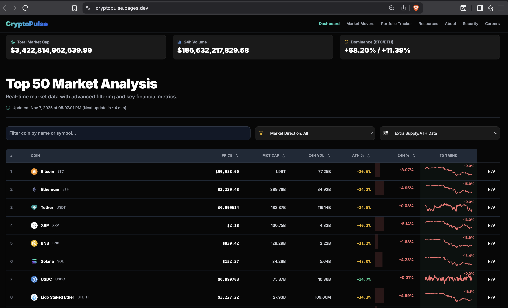
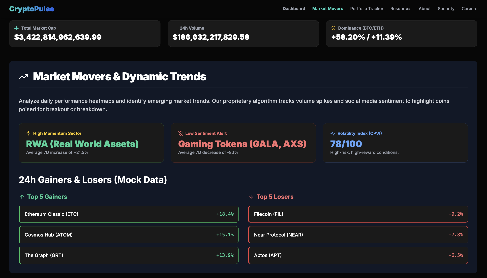
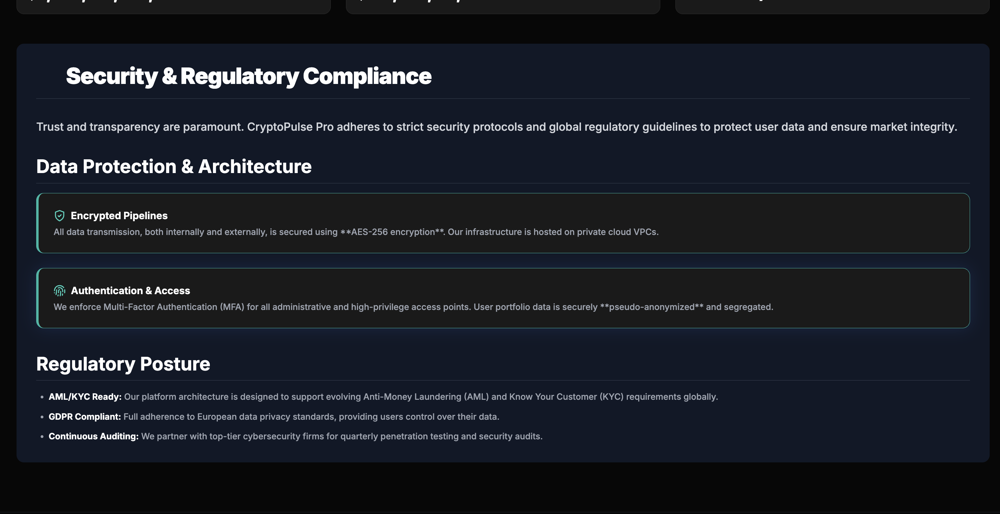
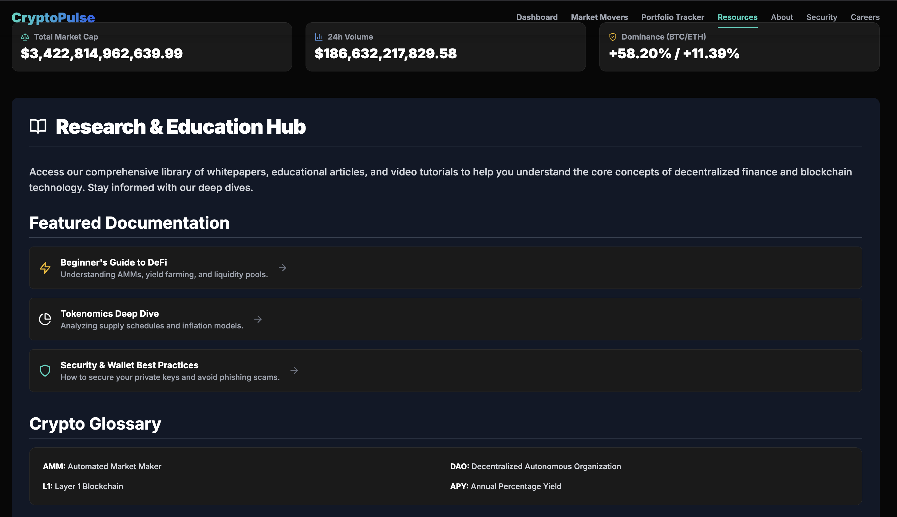

# 💹 CryptoPulse Pro

A professional‑grade cryptocurrency analytics dashboard with **real‑time market data**, portfolio tracking, and educational resources — all in a sleek dark UI powered by TailwindCSS.

👉 **Live Demo:** [cryptopulse.pages.dev](https://cryptopulse.pages.dev/)  
👉 **GitHub Repo:** [crypto-pulse](https://github.com/bhanu2006-24/crypto-pulse)

---

## ✨ Features
- 📊 **Top 50 Market Analysis** – Live data from CoinGecko API  
- 🔍 **Filtering & Sorting** – Search by name/symbol, sort by price, market cap, volume  
- 📈 **7D Trends & Sparklines** – Visualize short‑term performance  
- 💼 **Portfolio Tracker** – Simulated analytics + wallet connect (future‑ready)  
- 📚 **Research Hub** – Guides, tokenomics, and security best practices  
- 🔐 **Security & Compliance** – Dedicated section for transparency  
- 🌍 **Careers Section** – Showcases open roles and company vision  

---

## 📸 Screenshots

### Dashboard Overview


### Market Movers


### Security 


### Research Hub



---

## ⚙️ Tech Stack
- **Frontend:** HTML5, TailwindCSS, JavaScript (ES6+)  
- **Data Source:** CoinGecko API  
- **Icons:** Lucide  
- **Fonts:** Google Fonts (Inter)  

---

## 🚀 Getting Started

Clone the repository and open `index.html` in your browser:

```bash
git clone https://github.com/bhanu2006-24/crypto-pulse.git
cd crypto-pulse
open index.html   # or double-click in file explorer
